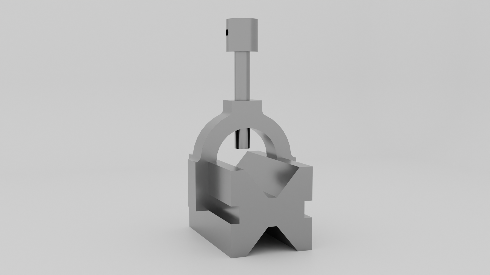

# V-Block
## Project Overview

This project showcases the modeling and visualization of a V-Block, a common precision work-holding tool used in machining and inspection processes. The model was created in AutoCAD based on a reference image and later rendered in Blender to produce a realistic visual presentation.

The focus of this project was on accurate geometry, clean modeling practices, and clear visualization rather than parametric design or manufacturing tolerances.

## Tools & Software

- AutoCAD - 3D modeling and solid construction

- Blender - Rendering, materials, lighting, and final visualization

## Modeling Process

- Modeled the V-Block geometry in AutoCAD using a reference image as a guide
- Focused on correct proportions, symmetry, and clean solid features
- Exported the model to Blender for visualization
- Applied neutral materials and soft lighting to clearly showcase form and detail

## Key Features

- Accurate V-groove geometry for cylindrical workpiece support
- Clean solid modeling with sharp edges and defined cuts
- Neutral, studio-style render to highlight shape and structure

## Render Preview

## Purpose of the Project

**This project was created to:**

- Practice 3D solid modeling in AutoCAD
- Improve workflow between CAD software and Blender

## Notes
- Model was created from an image reference and is not based on a manufacturing drawing
- Dimensions are representative and intended for visualization purposes